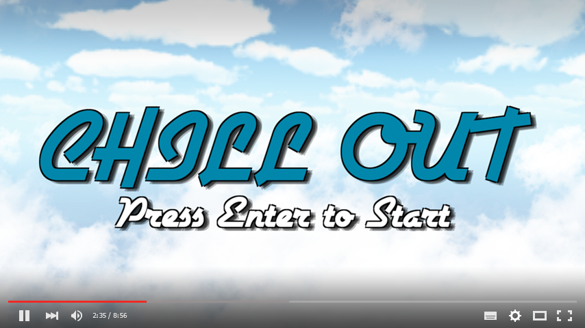

# Chill Out Retrospective

Chill Out was my entry into the 2016 Little Awful Jam, a two-week game jam with the theme of 'Chill'. Chill Out won the Jam, and led to further opportunities for Flatbox Studios.

[Video Playthrough](https://www.youtube.com/watch?v=iCu9sh_6b0k):

[Video of the judges playthrough](https://youtu.be/-XeKaYpX4W8?list=PLvsRQ9bQ1QDPDQAN2DNRjz5AYpXCbq0FX&t=2161)

[Link to jam entry](http://www.awfuljams.com/little-awful-2016/games/chill-out)

Starting off, I decided to spend my time modelling and creating a room with interactive objects for the player to enjoy. Like most of our projects, I started small. I used physics springs for click-and-drag movement in a 3D space. One end of the spring is attached to a point found using a forward raycast from the camera (to determine where a player 'grabbed' an object). The other end of the spring is attached to a point slightly in front of the camera. Objects such as the toc-tac-toe board begin new activities. The player begins these activities by looking at the object and pressing a keyboard key. I created an interface which causes these objects to glow when looked at, and shifts the player to a different set of controls when the activity begins.

Once I confirmed the character controller worked well, it was a question of what activities to include. This list bounced around for a bit, I would churn out models and we would weigh what was or wasn't working. The real visual improvements came when I started playing around with lighting. The ability to handle linear rendering helped reduce glare on standard shaders, and the GI improvements to Unity 5 really started to show.

Eventually the first week was up and most of the activities were implemented, but I still hadn't decided on an ending. One option was a hidden party mode that would bring down a disco ball and raise a beerpong table. Another option was implementing an outdoors scene, where a whole other set of activities could be found. Yet another option had the player leave the room to an outdoor scene suspended on a white cube in a void. The player would end the game by falling into the void. Early tests indicated it would be too difficult to keep the same quality as the first half of the game.

Instead, I opted to add an escape-the-room puzzle ('Chill Out' is a terrible pun: what else would you call a game where the objective is to get out of a chill room?) I thought it would be fun to hide the puzzle well enough where some players might miss it entirely. We hit the nail on the head: some judges missed the puzzle, while others stumbled upon it right when they thought they were done with the game. This caused judges to revisit the game, praising the ability to hide a game-within-a-game in an entry to such a short jam.

I added a few narrative elements including a brochure for DynaMind Solutions. The suggested narrative is that the character has uploaded their mind into a virtual room to chill forever. When the player escapes, they unlock an elevator which brings them right back where they began (with the added bonus of a kazzoo that spits out confetti). This suggests that escape is impossible, and that the game isn't quite as chill as is otherwise presented.

Chill Out was a great success and helped launch Flatbox Studios to a better position in the gaming industry. It was our first winning entry into a GameJam, and is a good display of the various skills required to develop games in Unity. After uploading our official submission, I created a VR version of the game which supported the Oculus Rift. I was interested in building a similar game for the Vive, and messaged Valve CEO Gabe Newell (infamous for reading direct emails). This led to the team recieving prototype hardware of the Vive and Oculus Rift. We would go on to create Skeet: VR Target Shooting before the Vive was launched, and were invited to attend Steam: Dev Days 2016 in Seattle.
